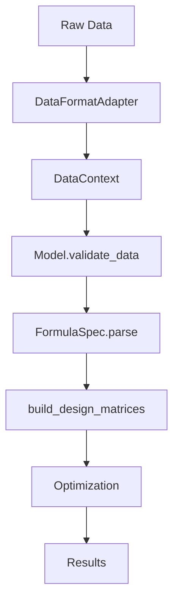

# Pradel-JAX Architecture Overview

This document provides a high-level overview of the Pradel-JAX architecture and design principles.

## 🏗️ Framework Architecture

Pradel-JAX follows a modular, layered architecture designed for extensibility and performance:

```
┌─────────────────────────────────────────────────────────────┐
│                    User Interface Layer                     │
├─────────────────────────────────────────────────────────────┤
│                     Core API Layer                         │
├─────────────────────────────────────────────────────────────┤
│    Models    │  Optimization  │  Formulas  │     Data      │
├─────────────────────────────────────────────────────────────┤
│                  JAX Computation Engine                     │
├─────────────────────────────────────────────────────────────┤
│               Platform Layer (CPU/GPU)                     │
└─────────────────────────────────────────────────────────────┘
```

## 📦 Module Structure

### `pradel_jax/core/`
**Core abstractions and shared interfaces**
- `api.py` - Main user-facing API functions
- `exceptions.py` - Structured error handling
- `models.py` - Abstract model interfaces

### `pradel_jax/models/`
**Model implementations**
- `base.py` - Abstract base classes for capture-recapture models
- `pradel.py` - Pradel model implementation
- Future: CJS, multi-state, robust design models

### `pradel_jax/optimization/`
**Optimization strategies and tools**
- `strategy.py` - Strategy selection and problem analysis
- `optimizers.py` - Optimizer implementations (L-BFGS, Adam, etc.)
- `orchestrator.py` - High-level optimization coordination
- `monitoring.py` - Performance monitoring and experiment tracking

### `pradel_jax/formulas/`
**R-style formula system**
- `parser.py` - Formula parsing and validation
- `spec.py` - Formula specifications and metadata
- `terms.py` - Individual formula terms (variables, interactions, functions)
- `design_matrix.py` - Design matrix construction

### `pradel_jax/data/`
**Data handling and validation**
- `adapters.py` - Data format adapters (RMark, Y-columns, etc.)
- `processor.py` - Data cleaning and preparation
- `validator.py` - Data validation and quality checks

### `pradel_jax/utils/`
**Utilities and helpers**
- `logging.py` - Structured logging system
- `validation.py` - Common validation functions

### `pradel_jax/config/`
**Configuration management**
- `settings.py` - Configuration schemas and defaults

## 🎯 Design Principles

### 1. Modularity
Each module has a clear, single responsibility:
- **Models** handle statistical computations
- **Optimization** manages parameter estimation
- **Formulas** parse and build design matrices
- **Data** handles input/output and validation

### 2. Extensibility
New components can be added without modifying existing code:
- New model types implement the `CaptureRecaptureModel` interface
- New optimizers implement the `BaseOptimizer` interface
- New data formats implement the `DataFormatAdapter` interface

### 3. Performance
JAX provides just-in-time compilation and automatic differentiation:
- Models compiled to optimized machine code
- Automatic gradients for optimization
- GPU acceleration when available
- Vectorized operations for large datasets

### 4. Robustness
Comprehensive error handling and validation:
- Structured exceptions with actionable suggestions
- Multi-level data validation
- Graceful fallback mechanisms in optimization
- Extensive logging for debugging

### 5. Usability
Clear APIs with excellent developer experience:
- Intuitive function names and signatures
- Rich error messages with suggestions
- Comprehensive documentation and examples
- R-style formula syntax familiar to statisticians

## 🔄 Data Flow

### Typical Analysis Workflow

1. **Data Loading**
   ```python
   data_context = pj.load_data("data.csv")  # Auto-detects format
   ```

2. **Model Specification**
   ```python
   formula = pj.create_formula_spec(
       phi="~age + sex",
       p="~time", 
       f="~1"
   )
   ```

3. **Model Creation**
   ```python
   model = pj.PradelModel()
   design_matrices = model.build_design_matrices(formula, data_context)
   ```

4. **Optimization**
   ```python
   result = pj.optimize_model(
       model.log_likelihood,
       initial_parameters,
       data_context
   )
   ```

### Internal Data Flow



## 🧩 Component Interactions

### Model ↔ Optimization
- Models provide likelihood functions and gradients
- Optimization chooses strategies based on problem characteristics
- Models provide parameter bounds and initial values

### Formula ↔ Data
- Formulas validate against available covariates
- Design matrices built from data and formula specifications
- Data adapters provide covariate information to formula system

### Optimization ↔ Monitoring
- Optimizers report progress to monitoring system
- Monitoring tracks convergence, performance metrics
- Experiment tracking for comparison and reproducibility

## 🎛️ Configuration System

Hierarchical configuration allows customization at multiple levels:

1. **Default Settings** - Built into the framework
2. **Configuration Files** - YAML files for project settings
3. **Environment Variables** - System-level overrides
4. **Runtime Parameters** - Function-level customization

Example:
```python
# Framework defaults
config = pj.get_config()

# Override for this analysis
config.optimization.strategy = "multi_start"
config.optimization.max_iterations = 2000

# Use in optimization
result = pj.optimize_model(..., config=config)
```

## 🔧 Extension Points

### Adding New Models
1. Inherit from `CaptureRecaptureModel`
2. Implement required methods (`log_likelihood`, `validate_data`, etc.)
3. Register with the model registry

### Adding New Optimizers
1. Inherit from `BaseOptimizer`
2. Implement the `optimize` method
3. Register with the optimization system

### Adding Data Formats
1. Inherit from `DataFormatAdapter`
2. Implement parsing and validation methods
3. Register with the data loading system

## 📊 Performance Characteristics

### Compilation
- JAX JIT compilation on first use
- Subsequent calls use optimized machine code
- Compilation time amortized over multiple runs

### Memory Usage
- JAX uses immutable arrays (functional programming)
- Memory-mapped data loading for large datasets
- Automatic memory management and garbage collection

### Scalability
- Vectorized operations scale with data size
- GPU acceleration for large models
- Distributed computing support planned

---

This architecture provides a solid foundation for capture-recapture modeling while remaining flexible enough to support future extensions and optimizations.